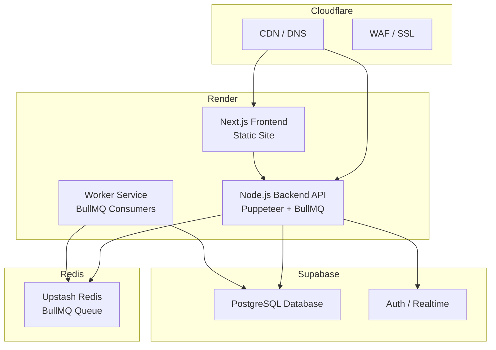
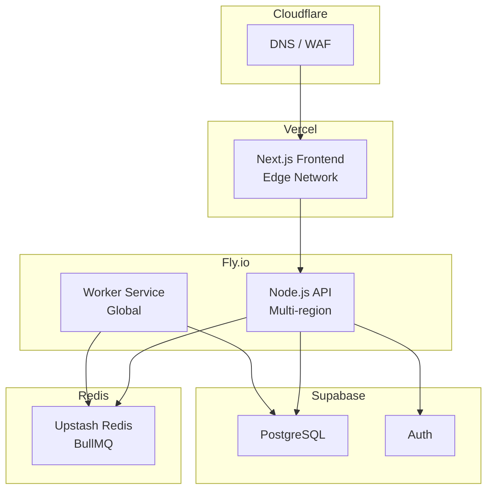

# Спецификация: Миграция на новый стек деплоя

## Metadata
- **Created**: 2025-02-18
- **Status**: Draft
- **Scope**: Large (архитектура деплоя, инфраструктура)
- **Author**: Harkly Team

---

## 1. Problem Statement

### Текущая ситуация
- Локальный Electron desktop app с RAG сервисом
- Puppeteer scraping работает локально
- Нет облачного деплоя

### Цель
Мигрировать на облачный стек с:
- **Puppeteer/headless Chrome** для скрейпинга
- **BullMQ** для очередей и воркеров
- **Supabase** как основная БД
- **Next.js** фронтенд (вместо Electron)
- **Дешёвый и простой деплой**

### Ограничения
- Puppeteer требует Chrome → нужна платформа с контейнерами и достаточным RAM
- Нельзя использовать Cloudflare Workers (128MB лимит, нет Chrome)
- Бюджет: минимальные затраты на старте

---

## 2. Solution Sketch

### Вариант 1: Render + Cloudflare (Рекомендуемый)



**Компоненты:**
1. **Render Static Site**: Next.js frontend ($0 free tier)
2. **Render Web Service**: Node.js API + Puppeteer ($7 always-on)
3. **Render Worker**: BullMQ consumers ($7 always-on)
4. **Upstash Redis**: BullMQ очереди (free tier)
5. **Supabase**: БД + Auth (free tier)
6. **Cloudflare**: DNS + CDN (free tier)

**Стоимость**: ~$14-20/мес (Render) + $0 (остальное на free tiers)

---

### Вариант 2: Fly.io + Vercel + Cloudflare (Глобальный)



**Компоненты:**
1. **Vercel**: Next.js frontend (free tier, edge)
2. **Fly.io**: Node.js API + Puppeteer ($2-10/мес)
3. **Fly.io Worker**: BullMQ consumers ($2-5/мес)
4. **Upstash Redis**: BullMQ очереди (free tier)
5. **Supabase**: БД + Auth (free tier)
6. **Cloudflare**: DNS + WAF (free tier)

**Стоимость**: ~$5-15/мес (Fly.io) + $0 (остальное)

---

## 3. Boundaries

### Внутри scope:
- [ ] Выбор между Render и Fly.io
- [ ] Конфигурация Docker/Puppeteer
- [ ] Настройка BullMQ с Upstash Redis
- [ ] Миграция с Electron на Next.js
- [ ] Настройка Supabase
- [ ] CI/CD pipeline

### За пределами scope:
- Изменение логики скрейпинга (только инфраструктура)
- Миграция данных (пока нет production данных)
- Мобильное приложение

---

## 4. Технические требования

### 4.1 Render Web Service (Puppeteer)

**Dockerfile:**
```dockerfile
FROM node:20-slim

# Install Chrome dependencies
RUN apt-get update && apt-get install -y \
    wget \
    gnupg \
    ca-certificates \
    fonts-liberation \
    libappindicator3-1 \
    libasound2 \
    libatk-bridge2.0-0 \
    libatk1.0-0 \
    libc6 \
    libcairo2 \
    libcups2 \
    libdbus-1-3 \
    libexpat1 \
    libfontconfig1 \
    libgbm1 \
    libgcc1 \
    libglib2.0-0 \
    libgtk-3-0 \
    libnspr4 \
    libnss3 \
    libpango-1.0-0 \
    libpangocairo-1.0-0 \
    libstdc++6 \
    libx11-6 \
    libx11-xcb1 \
    libxcb1 \
    libxcomposite1 \
    libxcursor1 \
    libxdamage1 \
    libxext6 \
    libxfixes3 \
    libxi6 \
    libxrandr2 \
    libxrender1 \
    libxss1 \
    libxtst6 \
    lsb-release \
    xdg-utils \
    --no-install-recommends \
    && rm -rf /var/lib/apt/lists/*

# Install Puppeteer Chrome
ENV PUPPETEER_SKIP_CHROMIUM_DOWNLOAD=true \
    PUPPETEER_EXECUTABLE_PATH=/usr/bin/google-chrome-stable

WORKDIR /app
COPY package*.json ./
RUN npm ci --only=production
COPY . .
EXPOSE 3000
CMD ["node", "dist/index.js"]
```

**render.yaml:**
```yaml
services:
  - type: web
    name: harkly-api
    runtime: docker
    plan: standard
    envVars:
      - key: NODE_ENV
        value: production
      - key: REDIS_URL
        fromService:
          type: redis
          name: harkly-redis
          property: connectionString
      - key: SUPABASE_URL
        sync: false
      - key: SUPABASE_KEY
        sync: false
    healthCheckPath: /health
```

---

### 4.2 Fly.io Configuration

**fly.toml:**
```toml
app = "harkly-api"
primary_region = "fra"

[build]
  dockerfile = "Dockerfile"

[env]
  NODE_ENV = "production"
  PORT = "8080"

[http_service]
  internal_port = 8080
  force_https = true
  auto_stop_machines = false
  auto_start_machines = true
  min_machines_running = 1

[[vm]]
  size = "shared-cpu-1x"
  memory = "1gb"

[mounts]
  source = "chrome_cache"
  destination = "/tmp"
```

---

### 4.3 BullMQ Configuration

**queue.ts:**
```typescript
import { Queue } from 'bullmq';
import IORedis from 'ioredis';

const redis = new IORedis(process.env.REDIS_URL!, {
    maxRetriesPerRequest: null,
    enableReadyCheck: false
});

export const scrapingQueue = new Queue('scraping', { connection: redis });
export const processingQueue = new Queue('processing', { connection: redis });
```

**worker.ts:**
```typescript
import { Worker } from 'bullmq';
import IORedis from 'ioredis';

const redis = new IORedis(process.env.REDIS_URL!, {
    maxRetriesPerRequest: null,
    enableReadyCheck: false
});

const scrapingWorker = new Worker('scraping', async (job) => {
    // Puppeteer scraping logic
}, { connection: redis });

scrapingWorker.on('completed', (job) => {
    console.log(`Job ${job.id} completed`);
});
```

---

## 5. Сравнение вариантов

| Критерий | Render + CF | Fly.io + Vercel |
|----------|-------------|-----------------|
| **Стоимость** | ~$14-20/мес | ~$5-15/мес |
| **Сложность** | ★★☆☆☆ Очень просто | ★★★☆☆ CLI + Docker |
| **Puppeteer** | Отлично | Отлично |
| **Глобальный edge** | Средне | ★★★★★ 30+ регионов |
| **Always-on** | $7/mo за сервис | Free allowance |
| **Масштабирование** | Вертикальное | Горизонтальное |
| **Community** | Большая | Растущая |

---

## 6. Рекомендация

**Выбрать: Render + Cloudflare (Вариант 1)**

**Обоснование:**
1. Почти идентичный DX к Railway (Git push → deploy)
2. Нет необходимости изучать fly.toml
3. Прозрачное ценообразование
4. Хорошая документация для Puppeteer
5. Проще для команды без опыта DevOps

**Fly.io лучше если:**
- Нужен lowest latency в многочисленных регионах
- Команда знает Docker
- Бюджет критичен

---

## 7. План миграции

### Phase 1: Подготовка (1-2 дня)
- [ ] Создать аккаунты Render, Supabase, Upstash, Cloudflare
- [ ] Настроить Supabase проект и схему БД
- [ ] Получить Redis URL от Upstash

### Phase 2: Backend API (2-3 дня)
- [ ] Создать Dockerfile с Puppeteer
- [ ] Настроить BullMQ с Redis
- [ ] Создать health check endpoint
- [ ] Деплой на Render Web Service

### Phase 3: Workers (1 день)
- [ ] Создать worker service
- [ ] Настроить BullMQ consumers
- [ ] Деплой на Render Worker

### Phase 4: Frontend (2-3 дня)
- [ ] Миграция Electron → Next.js
- [ ] Настроить API клиент
- [ ] Деплой на Render Static Site

### Phase 5: DNS + CDN (1 день)
- [ ] Настроить Cloudflare DNS
- [ ] Настроить SSL/TLS
- [ ] Настроить кастомный домен

---

## 8. Risk Assessment

| Риск | Вероятность | Влияние | Митигация |
|------|------------|---------|-----------|
| Puppeteer требует много RAM | Средняя | Высокое | Мониторинг, апгрейд plan при необходимости |
| BullMQ сложность | Низкая | Среднее | Тестирование локально, graceful shutdown |
| Миграция данных | Низкая | Среднее | Пока нет production данных |
| Cold start | Средняя | Низкое | Always-on план ($7) |

---

## 9. Success Criteria

- [ ] Frontend доступен по HTTPS
- [ ] API отвечает на health checks
- [ ] Puppeteer успешно скрейпит тестовые URL
- [ ] BullMQ обрабатывает задачи
- [ ] Supabase подключена и работает
- [ ] Время отклика API < 500ms
- [ ] Месячные затраты <$20

---

## 10. Notes

- Render free tier требует подтверждение телефона
- Supabase free tier: 500MB БД, 2GB bandwidth
- Upstash free tier: 10k requests/day
- Cloudflare free tier: неограниченный трафик

**Следующий шаг:** Утвердить спецификацию и начать Phase 1
