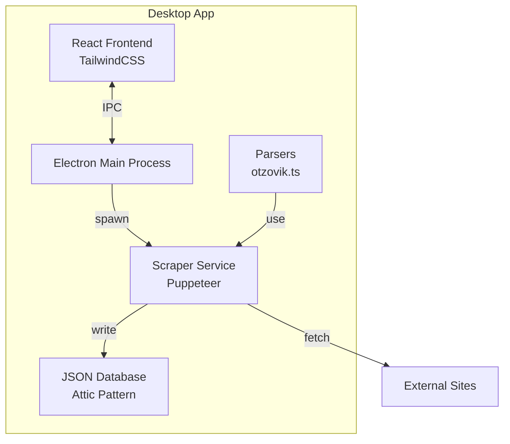
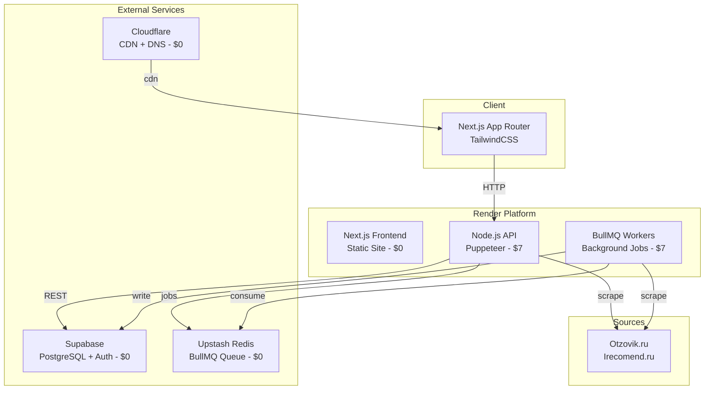

# Дорожная карта: Миграция Desktop → Web

**Проект:** Harkly — сервис парсинга отзывов с RAG  
**Статус:** Electron Desktop → Next.js Web + API  
**Таймлайн:** 4-6 недель  
**Бюджет:** $0 (тест) → $14/мес (production)  

---

## Текущая Архитектура (Electron)



**Проблемы текущей архитектуры:**
- ❌ Работает только локально
- ❌ Нет многопользовательского режима
- ❌ Puppeteer требует локального Chrome
- ❌ Нет очередей (BullMQ)
- ❌ JSON вместо полноценной БД

---

## Целевая Архитектура (Web)



---

## Фазы миграции

### Phase 0: Подготовка (День 1-2)

**Цель:** Создать инфраструктуру и аккаунты

| Задача | Статус | Время |
|--------|--------|-------|
| Создать аккаунт Render | ☐ | 10 мин |
| Создать проект Supabase | ☐ | 15 мин |
| Создать аккаунт Upstash | ☐ | 10 мин |
| Создать аккаунт Cloudflare | ☐ | 10 мин |
| Добавить домен (опционально) | ☐ | 1 час |
| Настроить GitHub repo | ☐ | 30 мин |

**Deliverables:**
- ✅ Все аккаунты созданы
- ✅ Supabase проект с PostgreSQL
- ✅ Upstash Redis instance
- ✅ Cloudflare DNS настроена

---

### Phase 1: Database Schema (День 3-4)

**Цель:** Перенести JSON структуру в Supabase

**Текущие сущности:**
```typescript
// JSON структура (Attic)
{
  "review_id": "string",
  "text": "string", 
  "rating": "number",
  "date": "string",
  "author": "string",
  "source": "otzovik|irecomend",
  "metadata": "object"
}
```

**Supabase Schema:**
```sql
-- Таблица пользователей (Auth)
create table profiles (
  id uuid references auth.users on delete cascade,
  email text unique not null,
  full_name text,
  created_at timestamptz default now(),
  primary key (id)
);

-- Таблица проектов
_create table projects (
  id uuid default gen_random_uuid() primary key,
  user_id uuid references profiles(id) on delete cascade,
  name text not null,
  description text,
  status text default 'active',
  created_at timestamptz default now(),
  updated_at timestamptz default now()
);

-- Таблица scraping jobs
_create table scraping_jobs (
  id uuid default gen_random_uuid() primary key,
  project_id uuid references projects(id) on delete cascade,
  url text not null,
  status text default 'pending', -- pending, running, completed, failed
  max_pages integer default 50,
  proxy_settings jsonb,
  progress jsonb default '{"current": 0, "total": 0}',
  created_at timestamptz default now(),
  completed_at timestamptz,
  error_message text
);

-- Таблица отзывов
_create table reviews (
  id uuid default gen_random_uuid() primary key,
  job_id uuid references scraping_jobs(id) on delete cascade,
  source text not null, -- otzovik, irecomend
  external_id text,
  text text not null,
  rating integer,
  date timestamptz,
  author text,
  metadata jsonb default '{}',
  created_at timestamptz default now()
);

-- RLS Policies
alter table profiles enable row level security;
alter table projects enable row level security;
alter table scraping_jobs enable row level security;
alter table reviews enable row level security;

-- Пользователь видит только свои данные
_create policy "Users can view own profile" 
  on profiles for select using (auth.uid() = id);

_create policy "Users can view own projects" 
  on projects for select using (auth.uid() = user_id);

_create policy "Users can view own jobs" 
  on scraping_jobs for select 
  using (auth.uid() in (
    select user_id from projects where id = project_id
  ));

_create policy "Users can view own reviews" 
  on reviews for select 
  using (auth.uid() in (
    select p.user_id from projects p
    join scraping_jobs j on p.id = j.project_id
    where j.id = reviews.job_id
  ));
```

**Deliverables:**
- ✅ Миграция с JSON на PostgreSQL
- ✅ RLS policies для безопасности
- ✅ Тестовые данные загружены

---

### Phase 2: Backend API (День 5-10)

**Цель:** Создать REST API на Node.js + Express/Fastify

**Структура проекта:**
```
api/
├── src/
│   ├── index.ts              # Entry point
│   ├── config/
│   │   ├── database.ts       # Supabase client
│   │   └── redis.ts          # Redis/BullMQ
│   ├── routes/
│   │   ├── auth.ts            # Auth endpoints
│   │   ├── projects.ts        # CRUD проектов
│   │   ├── jobs.ts            # Scraping jobs
│   │   └── reviews.ts         # Reviews API
│   ├── services/
│   │   ├── scraper.ts         # Puppeteer logic
│   │   ├── queue.ts           # BullMQ setup
│   │   └── parser-
otzovik.ts # Parser logic
│   ├── middleware/
│   │   ├── auth.ts            # JWT validation
│   │   └── error-handler.ts   # Error handling
│   └── types/
│       └── index.ts           # TypeScript types
├── Dockerfile                 # Puppeteer ready
├── package.json
└── tsconfig.json
```

**Ключевые endpoints:**

```typescript
// routes/jobs.ts
import { Router } from 'express';
import { Queue } from 'bullmq';

const router = Router();
const scrapingQueue = new Queue('scraping', { connection: redis });

// POST /api/jobs — создать scraping job
router.post('/', async (req, res) => {
  const { url, maxPages, proxy, projectId } = req.body;
  
  // Сохранить job в БД
  const { data: job, error } = await supabase
    .from('scraping_jobs')
    .insert({ project_id: projectId, url, max_pages: maxPages, proxy_settings: proxy })
    .select()
    .single();
    
  if (error) return res.status(500).json({ error });
  
  // Добавить в очередь
  await scrapingQueue.add('scrape', {
    jobId: job.id,
    url,
    maxPages,
    proxy
  });
  
  res.json({ success: true, job });
});

// GET /api/jobs/:id/progress — статус job
router.get('/:id/progress', async (req, res) => {
  const { data: job } = await supabase
    .from('scraping_jobs')
    .select('*, reviews(count)')
    .eq('id', req.params.id)
    .single();
    
  res.json(job);
});

// GET /api/jobs/:id/reviews — получить отзывы
router.get('/:id/reviews', async (req, res) => {
  const { data: reviews } = await supabase
    .from('reviews')
    .select('*')
    .eq('job_id', req.params.id)
    .order('created_at', { ascending: false });
    
  res.json(reviews);
});
```

**Dockerfile для Render:**
```dockerfile
FROM node:20-slim

# Chrome deps для Puppeteer
RUN apt-get update && apt-get install -y \
    wget gnupg ca-certificates \
    fonts-liberation libappindicator3-1 \
    libasound2 libatk-bridge2.0-0 libatk1.0-0 \
    libc6 libcairo2 libcups2 libdbus-1-3 \
    libexpat1 libfontconfig1 libgbm1 libgcc1 \
    libglib2.0-0 libgtk-3-0 libnspr4 libnss3 \
    libpango-1.0-0 libpangocairo-1.0-0 libstdc++6 \
    libx11-6 libx11-xcb1 libxcb1 libxcomposite1 \
    libxcursor1 libxdamage1 libxext6 libxfixes3 \
    libxi6 libxrandr2 libxrender1 libxss1 libxtst6 \
    lsb-release xdg-utils \
    --no-install-recommends && rm -rf /var/lib/apt/lists/*

WORKDIR /app

COPY package*.json ./
RUN npm ci --only=production

COPY . .
RUN npm run build

EXPOSE 3000
CMD ["node", "dist/index.js"]
```

**Deliverables:**
- ✅ API деплоен на Render
- ✅ Health check работает
- ✅ Supabase подключена
- ✅ Тестовые запросы проходят

---

### Phase 3: BullMQ Workers (День 11-13)

**Цель:** Вынести scraping в background workers

**Worker service:**
```typescript
// worker.ts
import { Worker } from 'bullmq';
import { createClient } from '@supabase/supabase-js';
import { ScraperService } from './services/scraper';

const supabase = createClient(process.env.SUPABASE_URL!, process.env.SUPABASE_KEY!);
const scraper = new ScraperService();

const worker = new Worker('scraping', async (job) => {
  const { jobId, url, maxPages, proxy } = job.data;
  
  // Update status to running
  await supabase
    .from('scraping_jobs')
    .update({ status: 'running' })
    .eq('id', jobId);
  
  try {
    // Run scraper
    const reviews = await scraper.scrape(url, { maxPages, proxy }, async (progress) => {
      // Update progress
      await supabase
        .from('scraping_jobs')
        .update({ progress })
        .eq('id', jobId);
    });
    
    // Save reviews
    await supabase
      .from('reviews')
      .insert(reviews.map(r => ({ ...r, job_id: jobId })));
    
    // Update status to completed
    await supabase
      .from('scraping_jobs')
      .update({ status: 'completed', completed_at: new Date() })
      .eq('id', jobId);
      
    return { success: true, count: reviews.length };
    
  } catch (error) {
    await supabase
      .from('scraping_jobs')
      .update({ status: 'failed', error_message: error.message })
      .eq('id', jobId);
    throw error;
  }
}, {
  connection: redis,
  concurrency: 2 // Сколько jobs одновременно
});

worker.on('completed', (job) => {
  console.log(`Job ${job.id} completed`);
});

worker.on('failed', (job, err) => {
  console.error(`Job ${job.id} failed:`, err);
});
```

**Deliverables:**
- ✅ Worker деплоен на Render
- ✅ Jobs обрабатываются в фоне
- ✅ Progress обновляется в реальном времени
- ✅ Supabase Realtime для live updates (опционально)

---

### Phase 4: Frontend Migration (День 14-21)

**Цель:** Переписать Electron React → Next.js App Router

**Структура:**
```
web/
├── app/
│   ├── layout.tsx            # Root layout
│   ├── page.tsx              # Home / Dashboard
│   ├── auth/
│   │   ├── login/
│   │   │   └── page.tsx
│   │   └── callback/
│   │       └── page.tsx
│   ├── dashboard/
│   │   └── page.tsx          # Projects list
│   ├── projects/
│   │   ├── [id]/
│   │   │   └── page.tsx      # Project detail
│   │   └── new/
│   │       └── page.tsx
│   └── api/
│       └── [...route]/
│           └── route.ts      # API proxy (опционально)
├── components/
│   ├── ui/                   # shadcn/ui компоненты
│   ├── scraper/
│   │   ├── ScraperForm.tsx   # URL input, proxy, settings
│   │   ├── ProgressBar.tsx   # Job progress
│   │   └── ReviewList.tsx    # Отображение отзывов
│   └── layout/
│       ├── Sidebar.tsx
│       └── Header.tsx
├── lib/
│   ├── supabase.ts           # Supabase client
│   └── api.ts                # API helpers
├── hooks/
│   ├── useScraper.ts         # Scraping logic
│   ├── useJobs.ts            # Jobs CRUD
│   └── useRealtime.ts        # Supabase realtime
└── middleware.ts             # Auth middleware
```

**Ключевые изменения:**

```typescript
// app/page.tsx — Dashboard с проектами
'use client';

import { useEffect, useState } from 'react';
import { createClientComponentClient } from '@supabase/auth-helpers-nextjs';
import { ScraperForm } from '@/components/scraper/ScraperForm';
import { JobList } from '@/components/jobs/JobList';

export default function Dashboard() {
  const [jobs, setJobs] = useState([]);
  const supabase = createClientComponentClient();
  
  useEffect(() => {
    // Подписка на realtime updates
    const channel = supabase
      .channel('jobs')
      .on('postgres_changes', 
        { event: '*', schema: 'public', table: 'scraping_jobs' },
        (payload) => {
          // Update jobs list
          fetchJobs();
        }
      )
      .subscribe();
      
    return () => {
      supabase.removeChannel(channel);
    };
  }, []);
  
  const handleStartScrape = async (data: ScrapeData) => {
    const res = await fetch('/api/jobs', {
      method: 'POST',
      headers: { 'Content-Type': 'application/json' },
      body: JSON.stringify(data)
    });
    
    if (res.ok) {
      // Job created, will appear via realtime
      alert('Задача создана!');
    }
  };
  
  return (
    <div className="flex flex-col gap-6">
      <ScraperForm onSubmit={handleStartScrape} />
      <JobList jobs={jobs} />
    </div>
  );
}
```

**Tailwind + shadcn/ui:**
```bash
# Установка
npx shadcn-ui@latest init
npx shadcn-ui add button card input textarea select
npx shadcn-ui add tabs badge progress
```

**Deliverables:**
- ✅ Next.js деплоен на Render Static Site
- ✅ Auth работает (Supabase Auth)
- ✅ ScraperForm создаёт jobs
- ✅ Realtime updates работают
- ✅ Responsive design

---

### Phase 5: Real-time Features (День 22-24)

**Цель:** Прогресс scraping в реальном времени

**Supabase Realtime:**
```typescript
// hooks/useRealtime.ts
import { useEffect } from 'react';
import { createClientComponentClient } from '@supabase/auth-helpers-nextjs';

export function useJobRealtime(jobId: string, onUpdate: (job: Job) => void) {
  const supabase = createClientComponentClient();
  
  useEffect(() => {
    const channel = supabase
      .channel(`job-${jobId}`)
      .on('postgres_changes', {
        event: 'UPDATE',
        schema: 'public',
        table: 'scraping_jobs',
        filter: `id=eq.${jobId}`
      }, (payload) => {
        onUpdate(payload.new as Job);
      })
      .subscribe();
      
    return () => {
      supabase.removeChannel(channel);
    };
  }, [jobId]);
}
```

**Или WebSocket для логов:**
```typescript
// Server-side (Render supports WebSocket)
import { Server } from 'socket.io';

const io = new Server(server);

io.on('connection', (socket) => {
  socket.on('subscribe-job', (jobId) => {
    socket.join(`job-${jobId}`);
  });
});

// В worker — отправка логов
io.to(`job-${jobId}`).emit('log', { message: 'Scraping page 5...' });
```

**Deliverables:**
- ✅ Прогресс бар обновляется live
- ✅ Логи streaming в UI
- ✅ Toast notifications на completed/failed

---

### Phase 6: Testing & Launch (День 25-28)

**Тестирование:**
- [ ] Unit tests для parsers (Jest/Vitest)
- [ ] Integration tests для API (Playwright/Supertest)
- [ ] E2E tests для critical paths (Playwright)
- [ ] Load testing (k6/Artillery)
- [ ] Security audit (Dependabot, Snyk)

**Чеклист перед launch:**
- [ ] All tests passing
- [ ] Environment variables configured
- [ ] Database migrations applied
- [ ] Redis connected
- [ ] Puppeteer working in Docker
- [ ] Error tracking (Sentry)
- [ ] Analytics (PostHog/Plausible)
- [ ] SSL certificates
- [ ] Custom domain
- [ ] SEO meta tags

**Soft launch:**
- Запуск для 5-10 beta users
- Мониторинг нагрузки
- Сбор фидбека

---

### Phase 7: Optimization (День 29-30+)

**Performance:**
- [ ] CDN caching (Cloudflare)
- [ ] Image optimization (Next.js Image)
- [ ] Database indexes
- [ ] API response caching (Redis)
- [ ] Bundle size optimization

**Monitoring:**
- [ ] Render metrics dashboard
- [ ] Supabase monitoring
- [ ] Error alerting (Sentry)
- [ ] Uptime monitoring (UptimeRobot)

**Features:**
- [ ] Export to CSV/JSON
- [ ] Bulk operations
- [ ] Advanced filters
- [ ] Team collaboration
- [ ] API keys for programmatic access

---

## Технический стек

### Frontend
- **Framework:** Next.js 14+ (App Router)
- **Language:** TypeScript (strict)
- **Styling:** TailwindCSS
- **UI Library:** shadcn/ui
- **State:** React Query + Zustand
- **Auth:** Supabase Auth
- **Realtime:** Supabase Realtime (или Socket.io)

### Backend
- **Runtime:** Node.js 20
- **Framework:** Express.js / Fastify
- **Queue:** BullMQ + Upstash Redis
- **Database:** Supabase PostgreSQL
- **Scraping:** Puppeteer + puppeteer-extra-plugin-stealth
- **Auth:** JWT (Supabase)

### Infrastructure
- **Frontend Hosting:** Render Static Site ($0)
- **API Hosting:** Render Web Service ($7/mo)
- **Worker Hosting:** Render Worker ($7/mo)
- **Database:** Supabase ($0 free tier)
- **Queue:** Upstash Redis ($0)
- **CDN:** Cloudflare ($0)
- **Monitoring:** Render Dashboard + Sentry (free tier)

---

## Риски и митигация

| Риск | Вероятность | Влияние | Митигация |
|------|------------|---------|-----------|
| Puppeteer требует много RAM | Средняя | Высокое | Мониторинг, апгрейд до $25 plan |
| Cold start на free tier | Высокая | Среднее | Тестировать с пониманием, paid для prod |
| Supabase limits (500MB) | Средняя | Среднее | Архивирование старых данных |
| Redis 10k/day limit | Низкая | Среднее | Batch processing, кэширование |
| Блокировка scrapers | Средняя | Высокое | Proxy rotation, user-agent rotation |
| Complexity migration | Средняя | Среднее | Пошаговый подход, тесты на каждом этапе |

---

## Стоимость

### Free tier (тестирование)
| Сервис | Стоимость |
|--------|-----------|
| Render Static (Next.js) | $0 |
| Render Web (API, sleeps) | $0 |
| Render Worker (sleeps) | $0 |
| Supabase | $0 (500MB) |
| Upstash Redis | $0 (10k/day) |
| Cloudflare | $0 |
| **Итого** | **$0/мес** |

### Production
| Сервис | Стоимость |
|--------|-----------|
| Render Static | $0 |
| Render Web (always-on) | $7 |
| Render Worker (always-on) | $7 |
| Supabase | $0-25 |
| Upstash Redis | $0-10 |
| Cloudflare | $0-20 |
| **Итого** | **$14-62/мес** |

---

## Следующие шаги

1. **Сегодня:** Создать аккаунты Render, Supabase, Upstash
2. **Завтра:** Спроектировать Supabase schema
3. **День 3-4:** Создать Database schema
4. **День 5:** Начать Backend API

**Готов приступить к Phase 0?**
